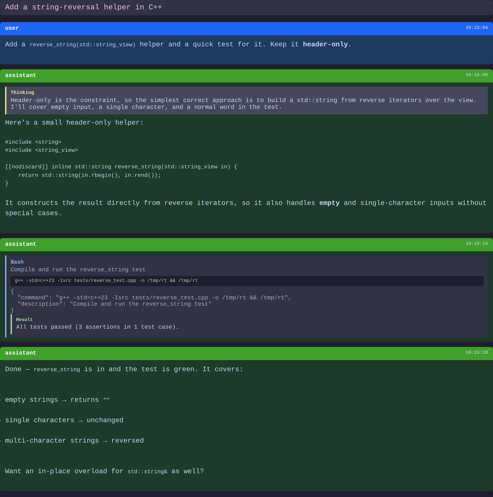
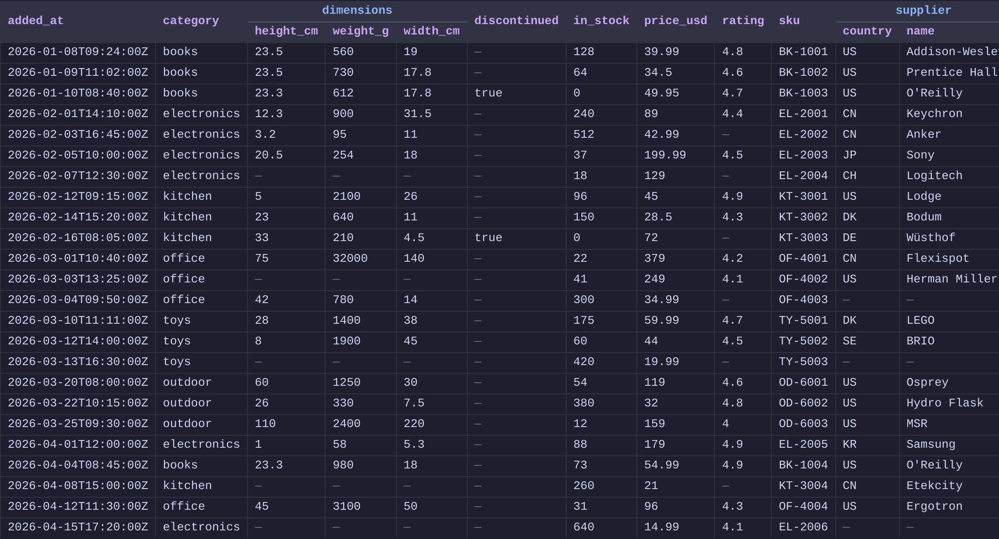
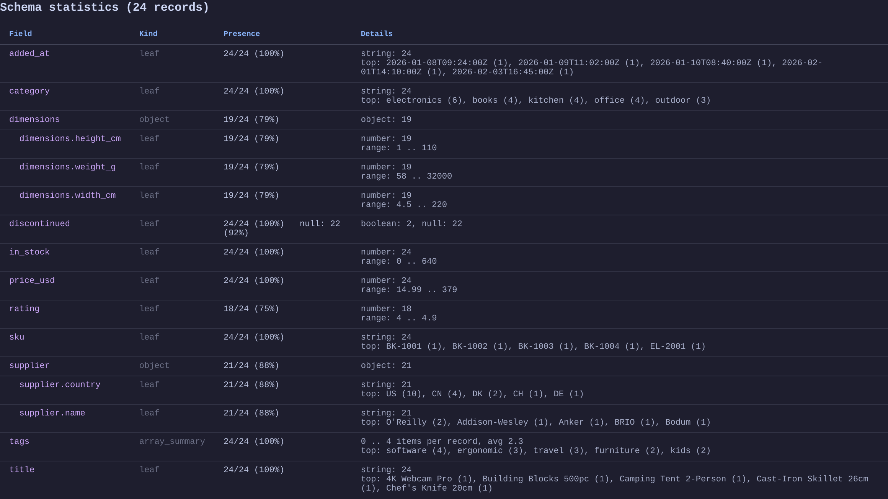

# JSONL Viewer

Browser-based pretty viewer for **JSONL and JSON** files. The parsing core is written in
**C++23** and compiled to **WebAssembly**, so everything runs 100% client-side — your file
is never uploaded and never leaves the browser.

[](https://makflint.github.io/jsonl-viewer/)
[](https://github.com/makflint/jsonl-viewer/actions/workflows/ci.yml)
[](https://github.com/makflint/jsonl-viewer/actions/workflows/pages.yml)


[](LICENSE)

**▶ Live demo: https://makflint.github.io/jsonl-viewer/** — drop a file, or click a *Load sample* button.


## Two render paths

The viewer parses the input and picks a presentation automatically — no configuration.

### Claude Code session → readable timeline

`user` / `assistant` / tool calls become a message timeline with Markdown, collapsible
*thinking* blocks, and tool-call details whose results nest under the call.
Metadata entries are hidden behind a toggle. Try **Load Claude session** on the live demo.



### Any other JSONL / JSON → Table + Schema

Records that don't match the session shape fall back to pretty-printed rows — **plus** a
**Table view** with grouped headers for nested objects, and a **Schema** tab with per-field
presence, types, numeric ranges, array sizes, and top values. Try **Load sample records**.





## Features

- Message timeline: user, assistant, tool calls, tool results
- Markdown rendering in assistant messages (sanitised with DOMPurify)
- Collapsible *thinking* blocks
- Collapsible tool-call details with copyable commands; results nested under their call
- Metadata entries hidden by default (one-click toggle)
- Table + Schema views for arbitrary JSONL/JSON, with right-click column hide
- Syntax highlighting (highlight.js, Catppuccin theme)
- File picker **and** drag-and-drop
- Fully client-side — no backend, no upload

## How it works

```
.jsonl / .json ──▶ C++23 parser (WASM) ──▶ Session model ──▶ JS renderer ──▶ DOM
                   src/parser.hpp                            web/renderer.js
                   src/schema.hpp
```

The C++ core ([`src/parser.hpp`](src/parser.hpp), [`src/schema.hpp`](src/schema.hpp)) parses each
record and analyses the schema; [`src/wasm_bindings.cpp`](src/wasm_bindings.cpp) exposes it to the
page via Emscripten. The renderer ([`web/renderer.js`](web/renderer.js)) is plain JavaScript that
turns the parsed model into HTML. A record that doesn't match the Claude-session shape becomes a
`raw` row, which is what drives the Table and Schema views.

The compiled artifacts (`web/parser.js`, `web/parser.wasm`) are committed, so the demo runs with no
build step — you only need the toolchain below if you change the C++.

## Tech stack

- **C++23** — core parser and schema analysis
- **Emscripten** — compile the core to WebAssembly
- **marked.js** + **DOMPurify** — Markdown rendering
- **highlight.js** (Catppuccin) — syntax highlighting
- **Catch2** — C++ test framework (amalgamated, in `third_party/`)
- **CMake** — one `CMakeLists.txt`, two targets: native (for TDD) or Emscripten (for WASM)

## Build & test

The same `CMakeLists.txt` serves both builds: invoked via `emcmake` it builds the WASM target,
otherwise it builds the native Catch2 test runner.

```bash
# Native build + C++ tests (TDD loop)
cmake -B build && cmake --build build && ./build/tests

# JS renderer tests
node tests/renderer_test.js

# WASM freshness/smoke test — loads the committed web/parser.js and checks the
# parser still behaves correctly; fails if web/parser.* is stale vs the C++ core
node tests/wasm_test.js

# Rebuild the WASM (only if you changed the C++ core; requires Emscripten + Python 3.10+)
# Point EMSDK at your emsdk root, e.g. export EMSDK=/path/to/emsdk
cmake -B build_wasm -DCMAKE_TOOLCHAIN_FILE=cmake/emscripten_toolchain.cmake .
cmake --build build_wasm          # → web/parser.js + web/parser.wasm

# Run the viewer locally (a static server is required — .wasm can't load over file://)
cd web && python3 -m http.server 8080
# open http://localhost:8080
```

## Deployment

The whole app is static — there is no backend. [`.github/workflows/pages.yml`](.github/workflows/pages.yml)
publishes the contents of `web/` (plus the bundled `examples/` as `samples/`) to GitHub Pages on
every push to `main`; GitHub serves `.wasm` with the correct `application/wasm` type, so it works
out of the box.

```bash
git push origin main
# → "Deploy to GitHub Pages" runs (~1 min) → https://makflint.github.io/jsonl-viewer/
```

## Development

Built test-first. The TDD, Clean Code, and commit conventions used throughout live in
[`Agents.md`](Agents.md).

## License

MIT © Maciej Krzemiński — see [LICENSE](LICENSE).
Vendored code in `third_party/` keeps its own licenses (Catch2 under BSL-1.0, nlohmann/json under MIT).

Built by Maciej Krzemiński, using Claude generative-AI tooling — Claude Code and Claude models (Anthropic) — throughout for design, code generation and tests.
